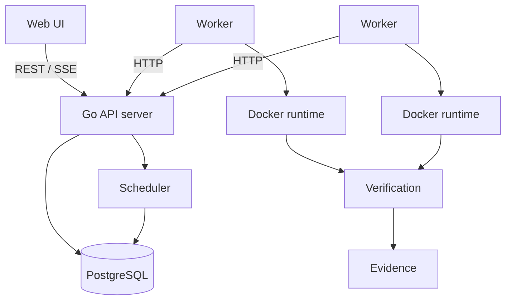

# Architecture

Tsuzuku Runner is an execution platform for autonomous software workloads. Its job is to make execution **continue safely** after failures: persist every workload durably, run it in an isolated runtime, verify the result independently of the executor, and keep enough evidence to explain every outcome.

## System overview

| Component    | Responsibility                                                                 |
| ------------ | ------------------------------------------------------------------------------ |
| API server   | Workload intake, job queries, worker coordination endpoints, log streaming     |
| PostgreSQL   | Durable source of truth for workloads, jobs, attempts, transitions, and events |
| Scheduler    | Places queued jobs on workers; runs inside the API server process              |
| Worker       | Claims assigned jobs, drives the runtime, reports logs and results             |
| Runtime      | Isolated execution environment (Docker for the MVP)                            |
| Verification | Independent checks that decide whether a job succeeded                         |
| Evidence     | Stored record that explains every final decision                               |

Workers talk to the control plane only through the HTTP API and never hold database credentials.

## Process layout

The codebase is a modular monolith ([ADR 0001](adr/0001-modular-monolith.md)) with two binaries:

| Binary        | Source        | Role                                     |
| ------------- | ------------- | ---------------------------------------- |
| `server`      | `cmd/server`  | API server and scheduler                 |
| `worker`      | `cmd/worker`  | Job execution on a host with Docker      |

Domain packages live under `internal/`, one package per bounded area (`api`, `job`, `scheduler`, `worker`, `runtime`, `verification`, `evidence`, ...). Packages are added as they gain real code.

## Configuration and logging

- Configuration is read from `TSUZUKU_*` environment variables into typed structs (`internal/config`) and validated at startup; invalid configuration fails fast.
- Logging uses `log/slog`: human-readable text in development, JSON in every other environment. Every record carries a `service` attribute (`server` or `worker`).
- Both processes shut down gracefully on `SIGINT`/`SIGTERM`.

## Status

This document grows with each milestone. Sections still to come: data model, job state machine, scheduling and claiming, runtime isolation, verification, and evidence.
