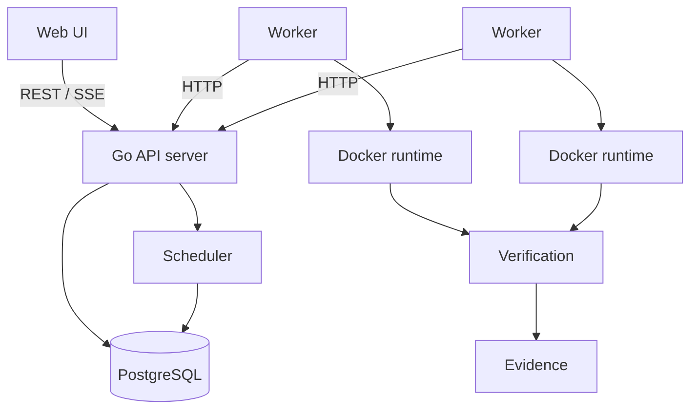
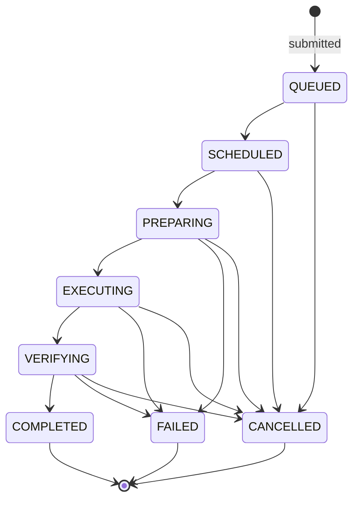
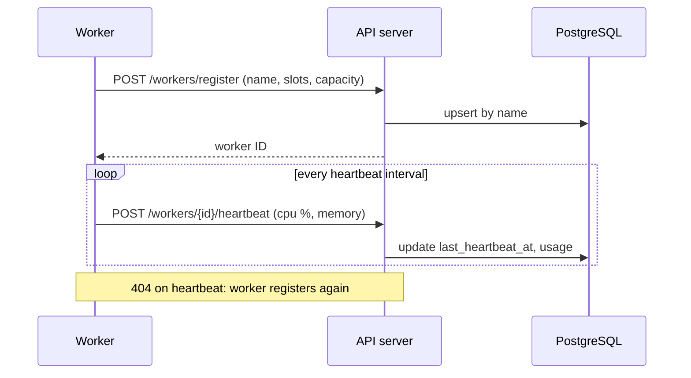
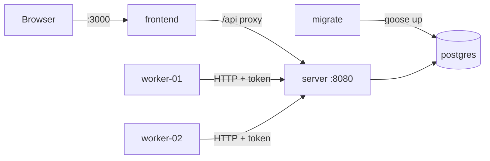

# Architecture

Tsuzuku Runner is an execution platform for autonomous software workloads. Its job is to make execution **continue safely** after failures: persist every workload durably, run it in an isolated runtime, verify the result independently of the executor, and keep enough evidence to explain every outcome.

## System overview

| Component    | Responsibility                                                                 |
| ------------ | ------------------------------------------------------------------------------ |
| API server   | Workload intake, job queries, worker coordination endpoints, log streaming     |
| PostgreSQL   | Durable source of truth for workloads, jobs, attempts, transitions, and events |
| Scheduler    | Places queued jobs on workers; runs inside the API server process              |
| Worker       | Claims assigned jobs, drives the runtime, reports logs and results             |
| Runtime      | Isolated execution environment (Docker for the MVP)                            |
| Verification | Independent checks that decide whether a job succeeded                         |
| Evidence     | Stored record that explains every final decision                               |

Workers talk to the control plane only through the HTTP API and never hold database credentials.

## Process layout

The codebase is a modular monolith ([ADR 0001](adr/0001-modular-monolith.md)) with two long-running binaries and two one-shot tools:

| Binary    | Source        | Role                                           |
| --------- | ------------- | ---------------------------------------------- |
| `server`  | `cmd/server`  | API server and scheduler                       |
| `worker`  | `cmd/worker`  | Job execution on a host with Docker            |
| `migrate` | `cmd/migrate` | Apply, roll back, or inspect schema migrations |
| `seed`    | `cmd/seed`    | Load example job history for development       |

The dashboard is a separate Next.js app in `frontend/`.

Domain packages live under `internal/`, one package per bounded area (`api`, `job`, `scheduler`, `worker`, `runtime`, `verification`, `evidence`, ...). Packages are added as they gain real code.

## Configuration and logging

- Configuration is read from `TSUZUKU_*` environment variables into typed structs (`internal/config`) and validated at startup; invalid configuration fails fast.
- Logging uses `log/slog`: human-readable text in development, JSON in every other environment. Every record carries a `service` attribute (`server` or `worker`).
- Both processes shut down gracefully on `SIGINT`/`SIGTERM`.

## HTTP API

Errors use RFC 9457 problem details (`application/problem+json`).

| Endpoint                              | Auth         | Purpose                                                    |
| ------------------------------------- | ------------ | ---------------------------------------------------------- |
| `GET /healthz`                        | none         | Liveness: the process is up                                |
| `GET /readyz`                         | none         | Readiness: the database answers a ping within 2s           |
| `POST /api/v1/workers/register`       | worker token | Register or re-register a worker; returns its ID           |
| `POST /api/v1/workers/{id}/heartbeat` | worker token | Report liveness and host usage; `404` if the ID is unknown |
| `GET /api/v1/workers`                 | none         | List workers with capacity, usage, and online status       |
| `POST /api/v1/workloads`              | none         | Submit a workload; creates a `QUEUED` job                  |
| `GET /api/v1/jobs`                    | none         | List jobs newest first (`state`, `limit`, `before` cursor) |
| `GET /api/v1/jobs/{id}`               | none         | Job with its workload and state history                    |
| `GET /api/v1/jobs/{id}/attempts`      | none         | Attempts in order                                          |
| `GET /api/v1/jobs/{id}/events`        | none         | Timeline events after an `after` cursor                    |
| `GET /api/v1/jobs/{id}/logs`          | none         | Log chunks after an `after` cursor (data is base64)        |

Workers authenticate with a shared bearer token (`TSUZUKU_WORKER_TOKEN`), compared in constant time. Request and response types for the worker endpoints live in `internal/workerapi`, which both binaries import.

`{id}` is a job UUID or its number, so `/api/v1/jobs/42` works. The submission and job endpoints have no authentication yet; every port binds to localhost only, and client authentication is a later milestone.

## Workload submission

`POST /api/v1/workloads` takes a JSON body:

| Field                       | Required | Default        | Rules                                                          |
| --------------------------- | -------- | -------------- | -------------------------------------------------------------- |
| `repository`                | yes      |                | `https://` URL without credentials, query, or fragment         |
| `revision`                  | yes      |                | Branch, tag, or commit                                         |
| `command`                   | yes      |                | Up to 4096 characters                                          |
| `acceptance_criteria`       | no       | `[]`           | Up to 20 entries of up to 500 characters                       |
| `resources.cpu`             | no       | 1 core         | 0.1 core up to `TSUZUKU_WORKLOAD_MAX_CPU_MILLIS`               |
| `resources.memory_mb`       | no       | 1024           | 64 up to `TSUZUKU_WORKLOAD_MAX_MEMORY_MB`                      |
| `timeout_seconds`           | no       | 600            | 1 up to `TSUZUKU_WORKLOAD_MAX_TIMEOUT`                         |
| `runtime.image`             | no       | `golang:1.27`  | Official `golang`, `node`, or `python` image; no tag means `latest` |
| `runtime.network`           | no       | `true`         |                                                                |
| `verification.command`      | no       |                | Run after `command` when given                                 |

Defaults above a configured maximum are lowered to it. Unknown fields and wrong types are rejected with `400`; values that break a rule return `422` with the field named in `detail`. The normalized spec, with every default filled in, is stored as `workloads.spec`.

A successful submission returns `201 Created`, a `Location` header, and the job. An optional `Idempotency-Key` header (1–255 visible ASCII characters) makes retries safe: the same key with the same normalized spec returns the original job with `200 OK` and `Idempotent-Replayed: true`; the same key with a different spec returns `409 Conflict`.

## Job lifecycle

`internal/job` owns the table of legal transitions; every change goes through `job.Transition`, which applies a compare-and-set update and records the history row and a timeline event in the same transaction ([ADR 0004](adr/0004-job-state-machine.md)). `RETRYING`, `REPAIRING`, and `BLOCKED` exist in the schema but have no edges until the milestones that use them.

## Worker lifecycle

- **Registration is an upsert by name.** A restarted worker keeps its ID and registration time; capacity and metadata are refreshed. Registration retries with exponential backoff (1s to 30s) until the API is reachable.
- **Liveness is derived, not stored.** A worker is `online` when its last heartbeat is no older than `TSUZUKU_WORKER_STALE_AFTER` (15s default, three missed 5s heartbeats). The comparison uses the database clock for both sides, so clock skew between hosts cannot flip the status.
- **Host usage** (CPU percent, used memory) comes from the latest heartbeat. If sampling fails, the worker still sends a heartbeat with the previous sample, because liveness matters more than fresh numbers.

## Dashboard

The dashboard (`frontend/`, Next.js) shows API liveness, database readiness, and the worker fleet, polling every 5 seconds.

The browser only talks to the dashboard's own origin. A route handler at `/api/[...path]` forwards an allowlisted set of `GET` paths (`/api/healthz`, `/api/readyz`, `/api/v1/*`) to the API at `TSUZUKU_API_URL`, read at request time. As a result:

- the Go API needs no CORS configuration;
- one dashboard image works in any environment, because the API address is not baked in at build time;
- an unreachable API turns into a `502` problem response instead of a browser network error.

## Local deployment

`compose.yaml` runs the whole system for development:

| Service                  | Image target            | Notes                                                                 |
| ------------------------ | ----------------------- | --------------------------------------------------------------------- |
| `postgres`               | `postgres:17-alpine`    | Published on `127.0.0.1:5433`                                         |
| `migrate`                | `Dockerfile` → `migrate` | One-shot `migrate up`; runs after Postgres is healthy                |
| `server`                 | `Dockerfile` → `server` | Starts only after `migrate` exits successfully; `127.0.0.1:8080`      |
| `worker-01`, `worker-02` | `Dockerfile` → `worker` | Fixed names, so restarts keep their registration                      |
| `frontend`               | `frontend/Dockerfile`   | Standalone Next.js server on `127.0.0.1:3000`                         |

The Go images are static binaries on a distroless, non-root base. All ports bind to localhost only. Compose falls back to a development worker token when `TSUZUKU_WORKER_TOKEN` is unset.

## Data model

PostgreSQL holds workloads, jobs, their full transition history, attempts, leases, logs, verification results, failures, and deliveries. It is also the job queue: queued work is jobs in state `QUEUED`, claimed with `FOR UPDATE SKIP LOCKED` and owned through expiring leases ([ADR 0003](adr/0003-postgres-as-job-queue.md)). Access goes through `internal/store`: a `pgxpool` connection pool, a `WithTx` transaction helper, and sqlc-generated queries ([ADR 0002](adr/0002-postgres-access-pgx-sqlc-goose.md)). Only `server`, `migrate`, and `seed` read `TSUZUKU_DATABASE_URL`.

See [Database design](database-design.md) for the schema, conventions, and the invariants the database enforces.

## Continuous integration

Every push to `main` and every pull request runs `.github/workflows/ci.yml`:

| Job                | Checks                                                                                |
| ------------------ | ------------------------------------------------------------------------------------- |
| Go                 | `go mod tidy -diff`, `go vet`, golangci-lint, unit and integration tests with `-race` |
| Generated code     | `sqlc diff` fails if `internal/store/db` is stale                                     |
| Dashboard          | `pnpm` lint, typecheck, and production build                                          |
| Compose smoke test | Builds every image, starts the stack, and waits for `/readyz` and two online workers  |

Third-party actions are pinned to commit SHAs. `task ci` runs the same checks locally, except the smoke test.

## Status

Milestone 0 (foundation) is complete: worker registration and heartbeats, the dashboard, the Compose stack, and CI. Milestone 1 has started with workload submission, the job state machine, and the job read endpoints. Sections still to come: scheduling and claiming, runtime isolation, verification, and evidence.
