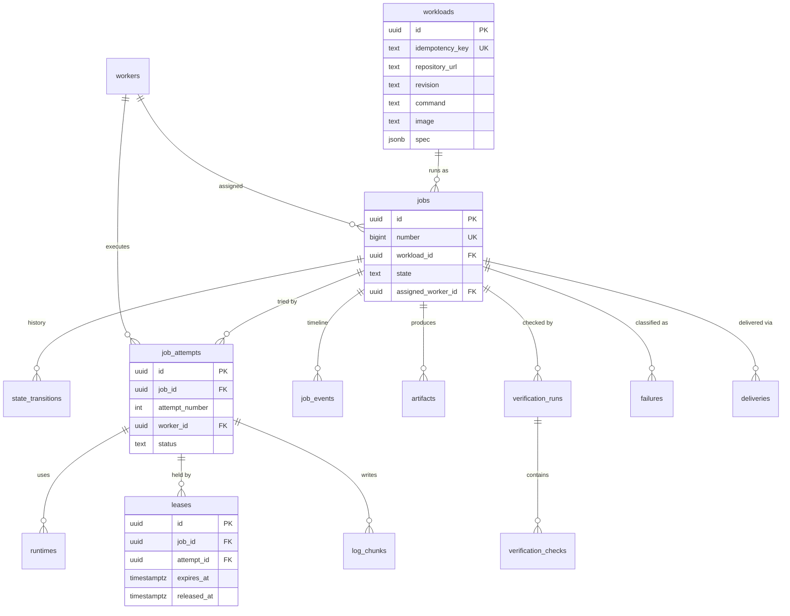

# Database design

PostgreSQL is the single source of truth. Every fact needed to explain a job's outcome is a row: what was asked, where it ran, what happened, how it was checked, and why it ended the way it did.

The schema lives in [`migrations/`](../migrations) and is applied with `task migrate:up`. Access is through queries in [`internal/store/queries/`](../internal/store/queries), compiled to Go by sqlc ([ADR 0002](adr/0002-postgres-access-pgx-sqlc-goose.md)).

## Entity relationships

## Tables

| Migration | Table                 | Purpose                                                                                   |
| --------- | --------------------- | ----------------------------------------------------------------------------------------- |
| 00001     | `workers`             | Registered workers, their capacity, and last heartbeat. Liveness is derived, not stored.  |
| 00002     | `workloads`           | The immutable request: repository, revision, command, image, limits, and the raw spec.    |
| 00002     | `jobs`                | One execution of a workload and its current state. `number` is the human-friendly `#123`. |
| 00002     | `state_transitions`   | Append-only history of every state change, with actor and reason.                         |
| 00003     | `job_attempts`        | One row per try. Retries and reassignments add rows; nothing is overwritten.              |
| 00003     | `job_events`          | Timeline feed for the UI and live streams.                                                |
| 00003     | `runtimes`            | Each container an attempt used (prepare, execute, verify) and its limits.                 |
| 00003     | `leases`              | Time-bounded claim of a job by a worker.                                                  |
| 00003     | `log_chunks`          | Raw stdout/stderr bytes, ordered by `seq` per attempt.                                    |
| 00003     | `artifacts`           | Metadata for stored files (logs, patches, reports); content lives in the artifact store under `storage_key`. |
| 00004     | `verification_runs`   | One verification pass over an attempt.                                                    |
| 00004     | `verification_checks` | Individual checks within a run and their result.                                          |
| 00004     | `failures`            | Classified failures (category plus message and details).                                  |
| 00004     | `deliveries`          | Outbound results (patch, pull request, ...) with an idempotency key.                      |
| 00005     | `workers` (columns)   | Host CPU and memory usage from the latest heartbeat; `NULL` until the first heartbeat.    |

## Conventions

- **IDs.** Entities use UUIDv7 generated in Go, so IDs sort by creation time and can be created before the insert. Append-only, high-volume tables (`state_transitions`, `job_events`, `log_chunks`) use `bigint` identity keys, which also serve as stream cursors.
- **States and categories** are `text` columns with `CHECK` constraints instead of PostgreSQL enums. Adding a value is a one-line migration and never requires `ALTER TYPE`.
- **Timestamps** are always `timestamptz`.
- **Foreign keys** use the default `NO ACTION`: history is never deleted implicitly. Deleting a referenced row fails.
- **Limits.** The database enforces only sanity (positive CPU, memory, and timeout). Policy limits such as maximum memory live in application configuration so they can change without a migration. CPU is stored in millicores.
- **Raw output** is stored as `bytea` because process output is not guaranteed to be valid UTF-8.

## Invariants enforced by the database

| Invariant                                       | Enforcement                                                       |
| ----------------------------------------------- | ----------------------------------------------------------------- |
| A job is always in a known state                | `CHECK` on `jobs.state` and both columns of `state_transitions`   |
| A submission is accepted at most once           | `UNIQUE (workloads.idempotency_key)`; `NULL` keys never conflict  |
| At most one active lease per job                | Partial unique index on `leases (job_id) WHERE released_at IS NULL` |
| Re-sent log batches are not duplicated          | `UNIQUE (log_chunks.attempt_id, seq)`                             |
| Attempt numbers are unique per job              | `UNIQUE (job_attempts.job_id, attempt_number)`                    |
| A delivery is sent at most once                 | `UNIQUE (deliveries.idempotency_key)`                             |
| Artifact names are unique per job and attempt   | `UNIQUE NULLS NOT DISTINCT (job_id, attempt_id, name)`            |

State changes go through `TransitionJob`, a compare-and-set update (`WHERE id = $1 AND state = $from`). If another actor changed the job first, the update matches no row and the caller sees `pgx.ErrNoRows` instead of silently overwriting the newer state. Only `job.Transition` calls it: it checks the legal transitions first, then writes the update, its history row, and a `job.state_changed` event in one transaction (`store.WithTx`), and turns a missed update into `ErrConflict` or `ErrNotFound` ([ADR 0004](adr/0004-job-state-machine.md)).

`TransitionJob` can also set `assigned_worker_id` in the same statement, so a job is never `SCHEDULED` without its worker. It also maintains the job's timestamps: `started_at` is set the first time the job enters `PREPARING` and never changes after that, and `finished_at` is set when it enters `COMPLETED`, `FAILED`, or `CANCELLED`.

## Read paths

| Query                         | Used for                                                                   |
| ----------------------------- | -------------------------------------------------------------------------- |
| `GetWorkloadByIdempotencyKey` | Replaying a submission that reuses an `Idempotency-Key`                    |
| `GetJobByNumber`              | Looking a job up by its `#number`                                          |
| `ListJobs`                    | Newest-first listing with an optional state filter; `before` is a job number cursor |
| `ListJobEvents`               | Timeline after an event ID; the last ID returned is the next cursor        |
| `ListLogChunks`               | Log output after a chunk ID, with a row limit                              |
| `ListAttempts`                | A job's attempts in order                                                  |

## Queue paths

| Query                    | Used for                                                                                    |
| ------------------------ | ------------------------------------------------------------------------------------------- |
| `TryLockScheduler`       | `pg_try_advisory_xact_lock`: one scheduling round at a time across replicas, released at commit |
| `ListSchedulableWorkers` | Online workers (database clock) with their count of unfinished jobs                        |
| `LockQueuedJobs`         | Oldest placeable `QUEUED` jobs, `FOR UPDATE SKIP LOCKED`; served by `jobs_queue_idx`         |
| `LockNextAssignedJob`    | A worker's oldest `SCHEDULED` job, `FOR UPDATE SKIP LOCKED`; served by `jobs_assigned_worker_idx` |
| `NextAttemptNumber`      | The next attempt number for a job; `UNIQUE (job_id, attempt_number)` backs it up            |

`SKIP LOCKED` lets concurrent claimers pass over a row another transaction is taking instead of queueing behind it. A claim that finds nothing locked or assigned returns no row rather than waiting.

Cursors are the `bigint` keys (`jobs.number`, `job_events.id`, `log_chunks.id`), so paging stays stable while new rows arrive and needs no `OFFSET`.

## Execution paths

Every worker report about an attempt runs in one transaction that starts by locking the attempt row.

| Query               | Used for                                                                                   |
| ------------------- | ------------------------------------------------------------------------------------------ |
| `LockAttempt`       | `SELECT ... FOR UPDATE` on the attempt; the caller checks the worker owns it and it is `RUNNING` |
| `CreateRuntime`     | One row per container the attempt used, with the worker's start and end times              |
| `RecordAttemptExit` | Stores the command's exit code on the attempt                                              |
| `FinishAttempt`     | Sets the final attempt status, error, and `finished_at`; only matches a `RUNNING` attempt  |
| `ListRuntimes`      | A job's containers across all attempts, oldest first                                       |
| `AttemptLogBytes`   | Bytes already stored for an attempt, checked against the log limit before inserting        |
| `InsertLogChunk`    | One chunk, `ON CONFLICT (attempt_id, seq) DO NOTHING`; reports whether a row was written    |
| `ListAttemptLogChunks` | An attempt's chunks in `seq` order, joined into `stdout.log` and `stderr.log`           |
| `CreateArtifact`    | Artifact metadata, `ON CONFLICT DO NOTHING`, so storing an attempt's logs twice is harmless |
| `CreateVerificationRun`, `CreateVerificationCheck` | The verdict for an attempt and one row per check            |
| `CreateFailure`     | The category, message, and details of a failed attempt                                     |
| `RequestJobCancel`  | Sets `cancel_requested_at` on a `PREPARING`, `EXECUTING`, or `VERIFYING` job; keeps the first request's time |
| `ListCancelRequestedAttempts` | A worker's running attempts whose job has a pending cancel, returned on every heartbeat |

Locking the attempt serializes reports for the same attempt, so a retried report cannot race the original. The job's state still changes only through `job.Transition`, inside the same transaction: if the report is rejected, the runtime rows, checks, failure, and events it wrote roll back with it.

The `verifying` and `finish` reports read `jobs.cancel_requested_at` under that lock. A request that arrived before either report is therefore always seen, and the attempt ends `CANCELLED` regardless of what the worker reported. The `executing` report does not check it: the job keeps running until the worker hears about the request on its next heartbeat.

## Evidence paths

| Query                    | Used for                                                       |
| ------------------------ | -------------------------------------------------------------- |
| `ListArtifacts`          | A job's artifacts, oldest first                                |
| `GetArtifact`            | One artifact, matched on both its ID and its job's ID          |
| `ListVerificationRuns`   | A job's verification runs                                      |
| `ListVerificationChecks` | The checks of all of a job's runs, grouped by run in Go         |
| `ListFailures`           | A job's classified failures                                    |

Matching an artifact on its job as well as its ID means a URL cannot read another job's files by swapping the artifact ID.

## Local development

| Command               | What it does                                             |
| --------------------- | -------------------------------------------------------- |
| `task db:up`          | Start PostgreSQL 17 from `compose.yaml` on port 5433     |
| `task migrate:up`     | Apply pending migrations                                 |
| `task migrate:status` | Show which migrations are applied                        |
| `task seed`           | Insert example finished jobs (safe to rerun)             |
| `task db:psql`        | Open a `psql` shell                                      |
| `task db:reset`       | Delete the database volume and start fresh               |
| `task sqlc`           | Regenerate `internal/store/db` after changing SQL        |

The seed inserts one COMPLETED, one FAILED, and one CANCELLED job, owned by an offline worker named `seed-worker`, so the UI has history to show without anything being picked up by a scheduler. It refuses to run when `TSUZUKU_ENV=production`.

Integration tests (`task test:integration`) start a throwaway PostgreSQL container with Testcontainers; each test gets its own freshly migrated database.
